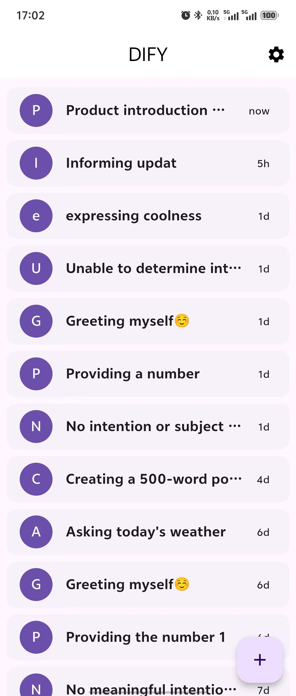
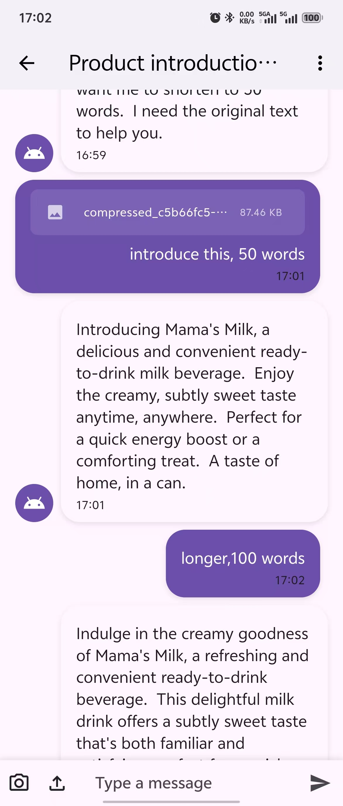

# Dify Chat App

A lot of web chat apps, but less native chat apps.

Try to write one with flutter and dify, use ai as much as possible.

## ScreenShot

| list | detail |
| -- | -- |
|  |  |

## Features

- [x] Stream response
- [x] Markdown render response
- [x] Upload multiple files
- [x] Easy take photo and compress it to upload
- [x] Flexable settings

## Plan

See [Development Plan](https://github.com/users/hjlarry/projects/3/views/1)

## How to use

Download the [Released Version](https://github.com/hjlarry/dify-flutter/releases)

Or run `flutter pub get` and `flutter run`.